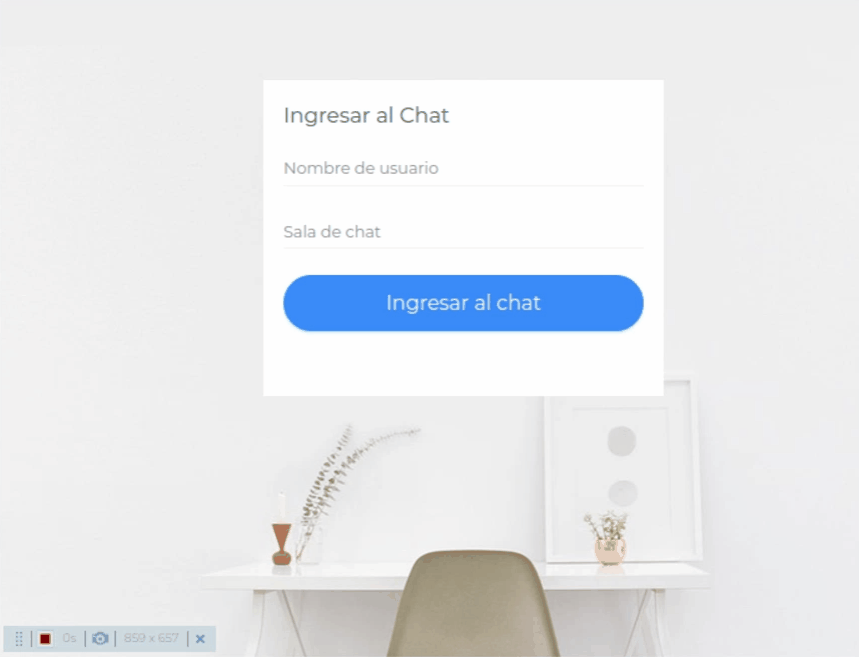
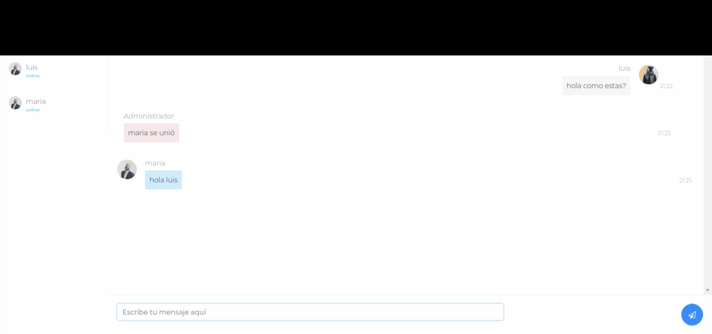
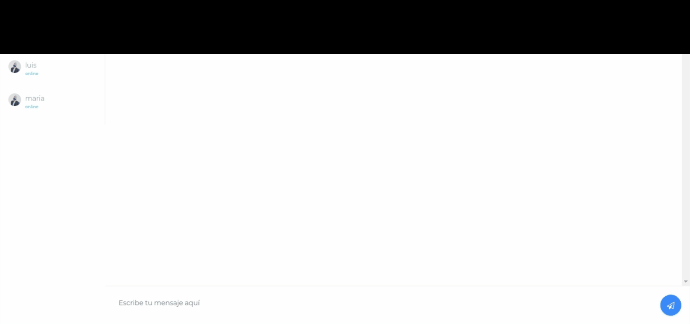

# Chat-sockets 🚀

Chat en linea utilizando sockets en nodeJS

### Instalación 🔧

primero instalar las dependencias:

```
npm install
```

luego arrancar el servidor con: 

```
npm start
```

Finalmente el servidor corriendo en el puerto 3000 : 

http://localhost:3000/

## Muestras ⚙️

loguear:



chat 1 a 1:






